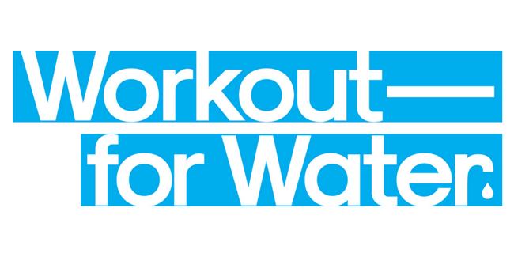
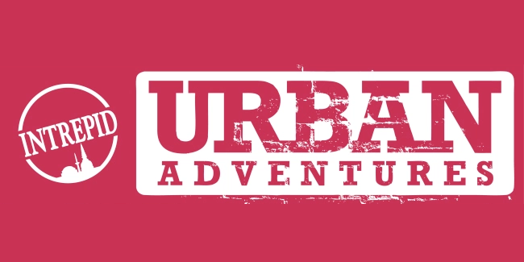
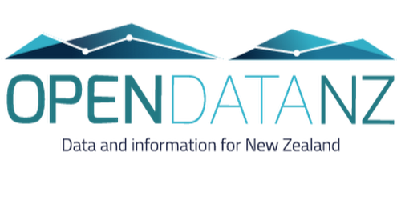
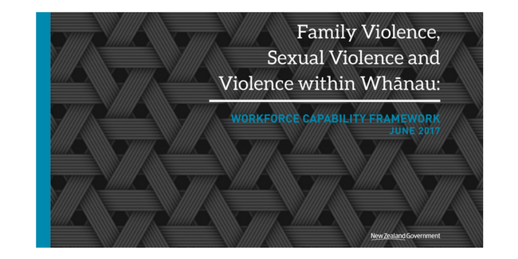
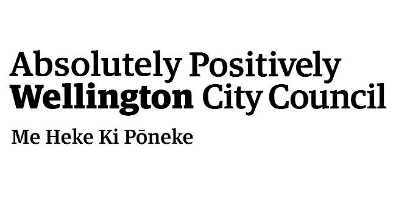

Stories from people using Loomio for everything from company governance, citizen engagement, event management, to grassroots political organising.

## Businesses & Co-ops

<strong>Conscious Consumers</strong> use Loomio for good governance. CEO Ben Gleisner explains the value of keeping all their information in one place, and including people along the way to a decision:

  <iframe src="https://www.youtube.com/embed/lOUm0qpgDAA?list=PLfeqYbxvuD29MfdIvQ7hnzg0LMcK4DEDZ" frameborder="0" allowfullscreen></iframe>

  

  
<strong>Les Mills and Unicef</strong> brought their strengths together in a global campaign. <a href="http://blog.loomio.org/2017/12/21/unicef-and-les-mills-use-loomio-to-coordinate-global-fundraising-campaign/" target="_blank">This story</a> tells how that resulted tens of thousands of people to "Workout for Water".

  

  
<strong>Urban Adventures</strong> are a startup with staff and partners spread across the globe. <a href="http://blog.loomio.org/2014/02/28/organising-adventure-across-six-continents/" target="_blank">In this story</a>, General Manager Tony Carne explains how Loomio has helped them manage conversations across the continents.

  <h3>Your Story Here</h3>
  
  
If you've got a Loomio story you'd like to share, <a href="https://loomio.org/contact" target="_blank">get in touch</a>.

---

* [SolidFund Coop](http://blog.loomio.org/2016/08/15/solidfund/) — make funding decisions with their members
* [NEIT](http://blog.loomio.org/2016/08/30/neit/) — unlock great ideas from the introverts
* [Trusty Amigos](http://blog.loomio.org/2016/08/17/trustyamigos/) — bilingual members jamming together
* [Robin Hood Coop](http://blog.loomio.org/2016/01/05/robinhood/) — massively increased member participation

---

## Government

<strong>Statistics New Zealand</strong> used Loomio to refine the questions in the 2018 Census with members of the public. In this video, they explain how Loomio allowed them to reach a greater number and diversity of people, compared to traditional citizen engagement methods.

  <iframe width="560" height="315" src="https://www.youtube.com/embed/HBfO62TXZSo?list=PLfeqYbxvuD29MfdIvQ7hnzg0LMcK4DEDZ" frameborder="0" allowfullscreen></iframe>

  

  
<strong>Land Information New Zealand (LINZ)</strong> used Loomio to engage stakeholders to develop NZ GOAL-SE: a framework for open source licensing of New Zealand Government software. <a href="http://blog.loomio.org/2016/05/11/nzgoal/"  target="_blank">Read the story</a> from Paul Stone, Programme Leader for Open Government Data at LINZ.

  

  
The <strong>New Zealand Government</strong> used Loomio for producing a Workforce Capability Framework. <a href="http://blog.loomio.org/2018/02/16/building-workforce-capability-to-address-family-violence-and-sexual-violence/" target="_blank">In this story,</a> Giselle Wansa-Harvey tells how Loomio was used in online consultation to reach wide range of people and organisations in the sector.
  

 

  

  
In 2013, <strong>Wellington City Council</strong> contracted Loomio to run the online side of their largest public consultation exercise of the year – developing an alcohol management strategy for the city.
  <a href="https://blog.loomio.org/2013/11/01/wellington-city-council-uses-loomio/" target="_blank">Read more...</a>

---

## Community

* [Equally Well](http://blog.loomio.org/2015/06/05/turning-a-conference-into-a-movement-with-loomio/) — turned a conference into a movement
* [Pathways](http://blog.loomio.org/2014/04/07/jacqui-graham-meaningful-engagement-in-a-large-organisation/) — create strong small teams within their organisation
* [Newtown Ethical Lending Trust](http://blog.loomio.org/2013/10/18/trustees-trust-loomio/) — approve loan applications without having a meeting

---

## Collectives

<strong>Kava Club</strong> is a Pacific & Māori arts collective. We talked to cofounder Leilani A Visesio about how Loomio helps them organise events, while keeping the group focussed on their purpose:

  <iframe src="https://www.youtube.com/embed/4zVCUOVbv6g?list=PLfeqYbxvuD29MfdIvQ7hnzg0LMcK4DEDZ" frameborder="0" allowfullscreen></iframe>

  
<iframe src="https://www.youtube.com/embed/KLKU9JbPel4?list=PLfeqYbxvuD29MfdIvQ7hnzg0LMcK4DEDZ" frameborder="0" allowfullscreen></iframe>

  
The <strong>P2P Foundation</strong> is a global network of researchers in open design, open hardware and free software. They use Loomio to delegate responsibility for an individual to act on behalf of the collective. Check out the video, or <a href="http://blog.loomio.org/2016/02/15/p2p/" target="_blank">read more here.</a>

  
<iframe src="https://www.youtube.com/embed/IVJyc5WnsE0?list=PLfeqYbxvuD29MfdIvQ7hnzg0LMcK4DEDZ" frameborder="0" allowfullscreen></iframe>

  
The <strong>Red Victorian</strong> is a co-living hotel and community gathering space. With Loomio they can document every voice and every thought that goes into a decision. <a href="http://blog.loomio.org/2016/02/04/redvic/" target="_blank">Read more...</a>

&nbsp;

  
<iframe src="https://www.youtube.com/embed/NTmpzY6cahI?list=PLfeqYbxvuD29MfdIvQ7hnzg0LMcK4DEDZ" frameborder="0" allowfullscreen></iframe>

  
<strong>Gängeviertel</strong> is a 200-person artist collective occupying 12 buildings in Hamburg, Germany. They use Loomio for in-depth discussions that can’t be decided in their in-person general assembly meetings. <a href="http://blog.loomio.org/2016/02/22/gaengeviertel/" target="_blank">Read more...</a>

  
<iframe src="https://www.youtube.com/embed/a8-FWXOkEBk?list=PLfeqYbxvuD29MfdIvQ7hnzg0LMcK4DEDZ" frameborder="0" allowfullscreen></iframe>

  
The <strong>Ouishare Network</strong> is an international community focusing on the collaborative economy and open source. They use Loomio to grow shared understanding around complex decisions. <a href="http://blog.loomio.org/2016/01/21/ouishare/" target="_blank">Read their story here.</a>

  

  
<strong>17 Tory St</strong> is a community space that hosts a huge diversity of events. <a href="https://medium.com/@richdecibels/how-to-run-an-open-source-community-space-76fba11483ae">This practical and inspiring story</a> explains how they use Loomio to manage the space without needing any meetings.

  
  
<strong>Guerilla Translation</strong> is a commons-oriented publishing collective. They use Loomio to organise their work and make decisions online without clogging up email inboxes. <a href="http://blog.loomio.org/2016/05/13/guerrilla-translation/" target="_blank">Read more...</a>

  <h3>Your Story Here</h3>
  
  
If you've got a Loomio story you'd like to share, <a href="https://loomio.org/contact" target="_blank">get in touch</a>.

---

## Political

* [Debt Resistance UK](http://blog.loomio.org/2016/03/07/druk/) — increased capacity by making decisions between meetings
* [COY11 Global Youth Coalition](http://blog.loomio.org/2015/12/23/coy11/) — self-organised to make an impact at COP21
* [Gen Zero](http://blog.loomio.org/2013/11/19/nation-changing-decision-makers-generation-zero/) — is a youth-led network of climate change activists who are campaigning to make New Zealand zero carbon by 2050
