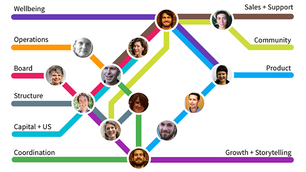
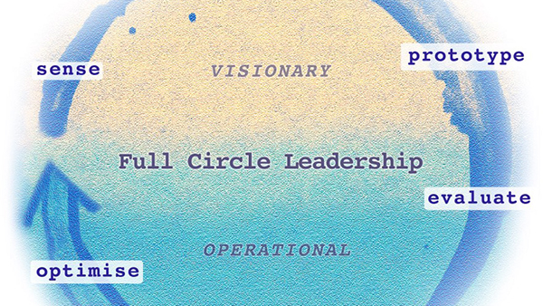
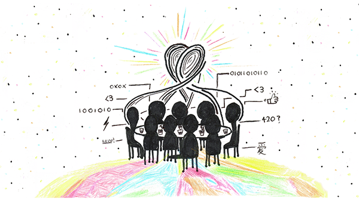

## Articles

<!-- <a href="six_circles.html">
  

    
    <h3>6 Circles For a Collaborative Group That Works</h3>
    
Lessons from 5 years working in non-hierarchical groups...

  

</a> -->

  
  <h3><a href="https://medium.com/enspiral-tales/bootstrapping-a-bossless-organisation-in-3-easy-steps-afc653e8f5e6#.wdnoa4f4x">
  Bootstrapping a Bossless Organisation in 3 Easy Steps ;-)</a>
  </h3>
  
How to keep a team together when nobody is in charge...

  
  <h3><a href="https://medium.com/enspiral-tales/beyond-dreamers-vs-doers-full-circle-leadership-869557da1248#.4h7ilp3w4">
  Beyond “Dreamers vs Doers” — Full Circle Leadership
  </a></h3>
  
Teams hum when you make space for many kinds of leadership...

  
  <h3>
  <a href="https://medium.com/enspiral-tales/how-to-grow-distributed-leadership-7f6b25f0361c">How to Grow Distributed Leadership</a>
  </h3>
  
Teams hum when you make space for many kinds of leadership...

  
  <h3>
  <a href="https://medium.com/enspiral-tales/a-caring-organisation-5319f81c420f#.sqwbtbqwt">A Caring Organisation: Feelings, Magic & Gendered work</a>
  </h3>
  
What happens when we talk about out feelings at work...

---

## Resources

* [Loomio Cooperative Handbook](http://loomio.coop)
* [Enspiral Handbook](http://handbook.enspiral.com)

---

## Podcasts

Theodore Taptiklis from the [Human Methods Lab](https://humanmethodslab.org/) interviewed people from 20 groups that are long-term Loomio users. He found that Loomio has altered and improved the conduct of these groups in many different ways:

<iframe width="100%" height="166" scrolling="no" frameborder="no" src="https://w.soundcloud.com/player/?url=https%3A//api.soundcloud.com/tracks/237611556&amp;color=ff5500"></iframe>
