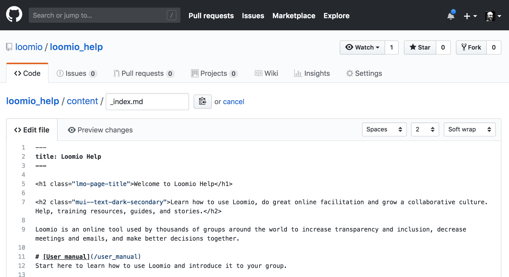
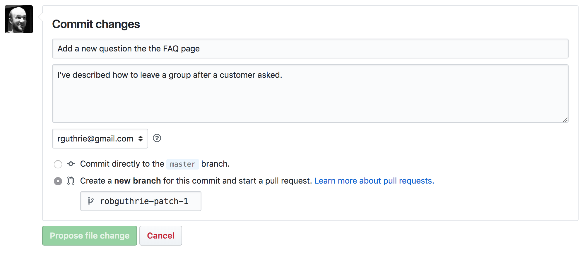

## About this help resource
- it's written in [Markdown](https://www.loomio.org/markdown)
- it's built with [Hugo](https://gohugo.io/)
- It's really easy to edit it even if you don't know what those things are (yet).

## How to make changes online via github.

1. Sign up for (or login to) Github and come back here.
2. Click edit at the bottom of the page. (eg: see the bottom of this page)
3. Agree to the kind offer Github has made to "clone" the repo.
3. Make some changes!

4. You can press "Preview" at the top of the text to check if things are working how you expect them to. When you're ready, scroll to the bottom and commit your changes. Select "Create a new branch for this commit and start a pull request"

## How to make changes on your computer.
If you know how to do that, why not edit this page and share it with others?
