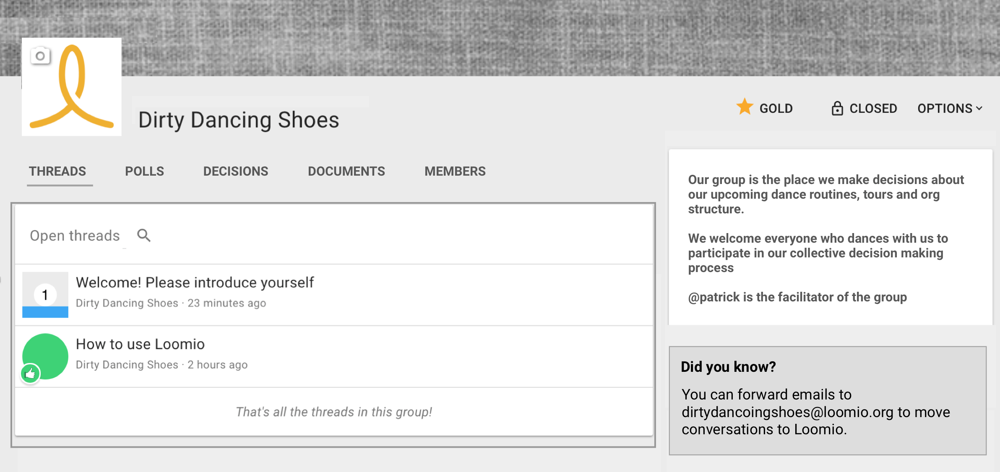
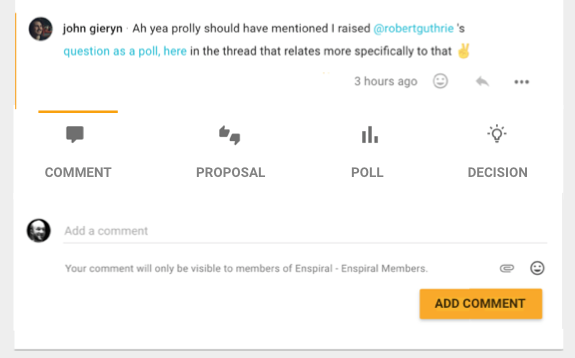
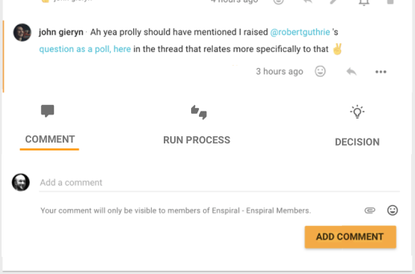
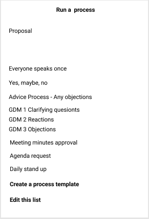
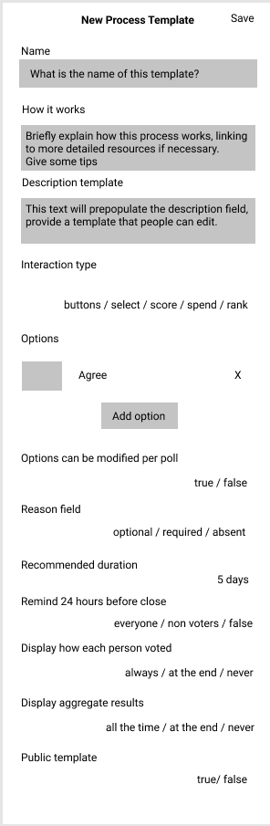
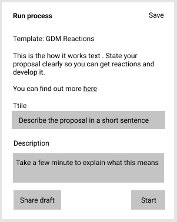

Our roadmap is guided by the customer research and direction decisions we've made in the last quarter of 2018.

The timeframes here are estimates, not promises.

## 2019-01 Add Microsoft Teams support
- drop interactive chat commands for now. IE: no /loomio poll commands
- subscribe any chat channel to a group's activity
- ability to edit which events are published to the team via config modal
- Follow up with Facebook and Telegram integrations shortly after this

## 2019-02 loomio.eu (beta) launch
- we often get customers asking for hosting based in EU
- similar to loomio.org, but based on EU hosted servers
- private beta period, customers who request are invited to the service

## 2019-02 Launch new marketing website
- targeting Governance, Organization, Engagement
- free trial is limited to 5 threads
- plans based around member size: 50, 500, 5000
- also releasing new onboarding help: demo videos, help docs, webinars, welcome email

## 2019-03 Migration from AngularJS to Vue completed
- Prepares us for mobile & desktop apps, improves performance and brings better ecosystem of libraries and developers.
- Work began in 2018.
- Big job, converting all frontend components from AngularJS to Vue2 and replacing angular-material with vuetify.
- adopt WYSIWYG text editor [tiptap](https://tiptap.scrumpy.io/) including support for mentions, file attachments
- No other significant changes to the UI/UX

## 2019-03 Outcome renamed to Decision.
- Enable 'decision' in a thread without a poll
- Group page gets tabs across top: Threads, Polls, Decisions, Documents, Members

## 2019-04 Single column thread page
- Display polls/proposals within the main column rather than on the right.
- Introduce "timeline view" for navigation of thread. This replaces "previous decisions" (on desktop timeline is rightbar, on mobile it's a dropdown.)
- Move new poll, decision stuff into add comment card at bottom of thread.

- title bar changes to thread title on scroll.
- default to chronological view but admins can change that per thread.

## 2019-04 Poll and thread templates

Proposal, Poll, Check, etc are all 'polls' with different settings. We're going to enable users to create their own "process templates" and save them within their group. So you can define what process your group uses to make a decision and save it so anyone can hold a process for a particular decision or question.

<!-- - allow grioto be defined for specific scenarios. eg: Advice, Consent
- choose or edit proposal templates. then proposal is just a few fields.
  save templates for particlar decisions you regularly make.
  template editor allows you to
  - edit which buttons are available and what they mean.
  - edit labels and placeholder, help text including the prompt, descriptions etc.
  - ability to share templates with other groups on loomio by marking as public
- ability to choose what templates are available within your group.
- start a proposal or thread from a template
  proposals and poll templates keep their options too.
  and make proposals completely editable. options, their names, etc.
  don't introduce more fields, but do introduce tagging.
- ability for polls to be "draft" so they can be edited, commented on, but not voted upon

- capture poll improvements from latest ux mockups. including
  - option: hide results until voting closed
  - option: draft mode (comment only, no voting)
  - option: start in future
  design your own proposal templates. choose from one when you begin.
    so choose thumbs 2, 3 or 4 ways.
    optionally define what they mean
    the templates come with guides that help you run the kind of process.
    you can share templates if you wish.

    It seems like we should consider making proposal templates editable? Then you could create some templates and offer them when people go to start a proposal, they could include guidance via an associated help page. -->

## Realtime Document editing, Improved document management and integration
rewritten UI will bring WYSIWYG including
  - ability to drag and drop images etc into comments, other text areas.
  - potential for realtime collaborative editing
  - rich formatting including lists, tables, checkboxes etc

So we're considering implementing a wiki-like document editing experience, so each group has a editable set of pages which you can collaborate upon within Loomio.

Also expect: improved group attachments page, simplifying and improving the search and integration of attachments (PDF's, google docs, etc)

## 2019-06 wall/feed view of dashboard, group pages
- view multiple threads on the same page, for mobile reading, better nav experience
- change current index views to be single line with columns

## 2019-06 Mobile, desktop app releases
- using container tech to wrap the webapp in native feel app
- push notifications
- app based UX - eg: button on homescreen, download from app store
- support refresh on reconnect

## 2019-06 improved membership management and group organisation
- parent group becomes "organisation", it does not have threads, just groups.
- subgroups become groups, parent group renamed to "general". org admins can admin any group within the org.
- starting a new group means choosing an existing org.
- org page that shows recent activity from all groups. (see basecamp)
- single membership page/directory for a whole org
- we base your org handle on your work email address
- when signing up we ask for the name of your organisation, then the group within it. eg: board or parents etc
- username is per org, so you can use common names like @michael.
- no more parent/subgroup headaches.
- organisation has handle, usually based on its official domain name
- automatically join your org when you use your work email.

## 2019-06 Integrations page
- list all the integrations and services your group uses, eg trello, zoom, google drive. and loomio will provide helpful integrations with those services including url redirects

---

implement https://www.twilio.com/blog/2018/03/better-passwords-in-ruby-applications-pwned-passwords-api.html

user setting to choose between weekly and daily summary emails

fetch draft when loading thread page so it does not overwrite exiting text when you start writing.

when people post links, expand them out on the comment or whatever.

The following items are things we want to do but have not prioritised or estimated yet.

- thread refinements
- extend "fork thread" function to become "move comments" which can be used to move comments to an existing thread or new thread.
- chronological mode by default? save setting for nested or chronological view on thread.

- improved tagging simple chip based tagging, use fulltext search, bring into main app out of plugin.

- improved search: unify search to top bar with optional org/group select

- bookmark thread or thread item

- remove 'invite people to vote' and change it to send notifications, and choose between group and thread

## collaborative document editing
Documents are something groups use with decision making naturally, have native collaborative document editing.

## private, chat threads
- easy to start private threads with people
- intro carousel for new users (actually everyone, when we release these updates)

## delegated votes/liquid democracy
each membership has a 'weight' column, which defaults to 1. for proposal polls, the stance_choice.score is the weight of the membership at the time.

membership weight is either assigned manually or is based on the number of representations assigned to a particular member in a group.

we need a screen so that members can select who they delegate their vote to.

---

select delegate or representative.. ability for members to select someone to carry their voting power, you can do it for a group or just a thread.

governance, management, engagement and organising

- ensure loomio can be embedded in webpages as a comment engine.

gives every thread and doc it's own group namespaced url. they can be linked between easily enspiral/100-1 (thread 100 comment 1)

- front page
- much faster user interface in vue.js
- proposals inline with threads
- timeline view allowing you to jump through the thread. all items on one line each.
- right bar is help. can be customised to your org with documents.
- threads can pin open a particlar help page. so people see it when they open the thread.
- wall interface with multiple threads.
- choose between nested or not and saves your preference (chronologcial by default?)
- link to thread by number? with # (or groupname#) (same as tag) simple urls? loomio.org/groupname/123
- subgroups are groupname-subgroupname
- tags are super simple single word labels
- groups are either public, private, or private + visible to parent members
- group's email is groupname@loomio.org (with # in subject)
- groups have a handle or shortname
- embrace the org domain. enspiral.com becomes enspiral with @ as default username
- company email address auto-join
- first 10 threads and 20 members free. then you pay use it more than that.
- if you stop paying your group gets paused, you can read and export, by not write.
- simplified member management.
  - manage all members in org
  - single page, easy to add people to subgroups.
  - export members as CSV.
- groups decide if they want to enable the membership directory.
  single admin status across all groups. - as a setting on new groups.
  single membership page per org
  member directory with bio and status messages
- private threads (member to member)
- integrations page, which links to your various online tools.
  highlight your group email address to cc loomio into any discussion
  zoom, google docs, trello, etc. gives redirect urls on group url.
    https://loomio.org/enspiral/zoom, googledocs, trello, slack
    redirects can be members only.
- mobile apps with mobile notifications
- collaborative editing on contexts, proposals, and documents
- drop all our custom emoji stuff and just use unicode. reactions too, order by use (over whole site?)
- click seen by. or notifications count. modal shows who have seen, been notified, not seen the thread and gives option to mention them in a comment.
- process guidance for for proposals and threads
  - threads assign some process document inside the thread
    these process gides intoduce a process or practice that is being adopted for this thread. we introduce the user to this by showing the process guide when you first arrive, then having it closed and on the right bar. these documents can be shared between threads and edited collaboratively.
  - proposals configurable buttons (tickbox above) (3 by default)
  - proposals have version (each time it goes to vote)
  - proposals have intention or ask: there are some defaults to choose from if you like.
  - proposals have draft or voting mode - if it's draft you can collaboratively edit it together.
  - it should still feel simple.

- mute for x time, max notifications: none, every 6, 12, 24, 48 hours. (with summarised update for that time period.)
- (later) choose between all threads in their own email, or everything in one.
- simple attachment & link management. supports tagging
- good centralised search with full page results and autosuggestions based on tags and words in titles, filter to an org or search whole site.
- sidebar slides from
  root - threads, groups, profile, etc,
  groups - lists all your groups and the number of unread threads in each
  threads - lists each thread in the group and if you've read it, unread items count, or just 'unread'
  items - the line by line version of the thread for navigation purposes.
  and at the top is the back button. <-
  under that is the current place name. thread, group, groups, all threads,

scheduling.. connect calendars etc

More notes (might be dupes)
loomio interface based on google news
- big search bar, suggested searches autocomplete
- simple nav bar.
- threads or wall in the middle.
- private threads between people
- collaborative document editing and annotating
- remove colours from tags and make them super easy, apply to anything
- bookmarks
- pictures/charts on the right. room for more people
- move to move single line, tablized view,
- complimented by wall view.
- 1h style dates with a clock logo?
- use usernames primarily to identify people? or drop them for just name.
- notification frequency to decide how often: immediate or daily or weekly
- show when people last viewed the thread somehow
- comment, propose
- make email feel native with group email addresses
