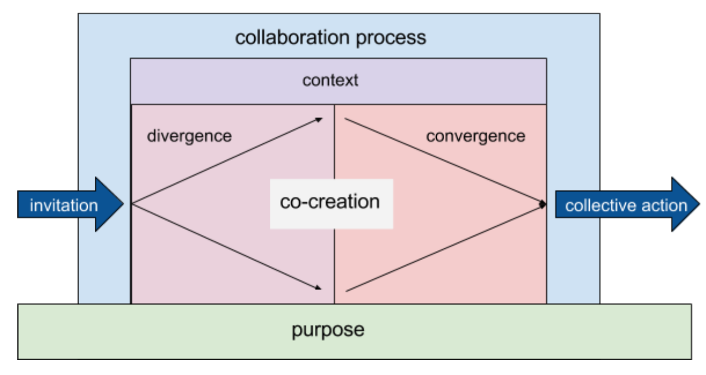

{}
  > For every minute of time with the group, consider spending 3 minutes planning. That means spending three hours preparing for a one hour session. Only as you improve should you spend less time planning. — Silvia Zuur
{}

## Understand Purpose

Clarification of purpose is one of the highest value offerings of a skilled facilitator — if they can help the group nail that, everything else is possible. Purpose operates at the level of a group as a whole, and at the level of individual discussions/decisions. Purpose is what enables judgment calls about what tools to deploy, what interventions to enact, and what outcomes to aim for. Lack of shared understanding about purpose can be fatal to a discussion, or to the group itself.

> Always refer back to your purpose-finding questions to check that you’re covering off what the participants want to learn or achieve. — Silvia Zuur

On Loomio

* The app offers space for explication of purpose, such as the [group description](../../user_manual/groups/settings/) and [discussion context](../../user_manual/threads/) fields.
* A Loomio discussion *about* purpose is a great place to start with your group, if it's not already clear.
* Our analytics (stats about how people use the software) show that groups with a clear shared purpose are more successful.
* [User interviews and case studies](../../blog_links/case_studies) we've collected emphasise the importance of setting a collective purpose.

## Rearrange the Furniture

Desiging the space you invite people into greatly influences their experience. Every gathering is unique, and deserves a setup to suit. Familiarity signals safety, while changing the environment cues opennes to new ideas.

In offline spaces, literally rearranging the furniture is a habit that helps facilitators get into the right zone to hold space, and prompts them to think about what’s unique in that session. Imagine the difference between everyone seated in rows versus everyone in a circle.

On Loomio

* Inviting people into a new digital space specifically for decision-making is powerful — there’s a “threshold crossing” experience making it as distinct from other online spaces (which might be for socialising or other functions).
* [Customising your group photo](../../user_manual/groups/settings/#adding-a-cover-photo) is a prime opportunity to craft the feeling of the space.
* The group description is a main piece of “furniture” on the group page, and [you can customise it](http://blog.loomio.org/2016/04/23/organise/) to suit.

## Supplies, Tools, Materials

When facilitation is running smoothly, all the supplies a group needs are right at hand. In offline spaces, this stuff like post-its, pens, paper, name tags, printouts, and background material. Every step a facilitator takes to be well-prepared in this way allows more time and energy for the work.

On Loomio

* Many groups use the group description to link out to a shared drive of collaborative documents, background information, the group's project management or task tracking system, a list of contacts, etc.
* Each thread deserves consideration of what people might need to engage with it — putting all the information right at hand is essential (for example, if you reference something, linking directly to it is much more effective than expecting people to search for it).

## Design the Experience

Once they have the basic pieces in place (purpose, tools, background info), good facilitators take time to think through the design of the experience they are inviting: the situation, what success could look like, all the possible pathways and choices. They don’t jump in without a considered design.

Time and time again we have seen people drastically underestimate the need for prep and design. Stop and think about the experience you want to hose, before jumping straight in. Investment in design is paid back many times over by success later.

On Loomio

* Loomio’s most basic functionality follows the structure of good facilitation by design: invite people, discuss a topic, gather divergent input, converge into a specific proposal, test for agreement, confirm outcome.

* Skilled users are already adapting Loomio for various experience designs — such as a multi-step consultation processes, signing off documents, etc. Each job, when facilitated effectively, takes a certain repeatable shape.
* Online collaboration design doesn't have to reinvent the wheel. Trust what you know works, and translate it. Many tried and tested offline processes can be adapted to the online space (ex: the [Advice Process](http://blog.loomio.org/2016/11/09/advice-process/)).
* [Case studies](../../blog_links/case_studies) of thoughtfully designed processes could be used as “recipes” — if you're ot sure what design to use, start by seeing what others have tried.

## Contextualise the Moment

Discussions do not occur in a vacuum, but in the larger context of the group’s history and practice. To be effective, facilitated experiences have to occur with the right timing, and fit in with the rest of the group’s process.

Key Context Questions:

* Is this a moment of transition?
* Is this an enhancement of existing practice?
* Is this one of many concurrent processes, or a singular focus?
* Are we here to solve a problem, or go deeper, wider, narrower?

On Loomio

* Loomio groups nearly always have a “champion”, who understands the group’s context and makes the call about whether introducing Loomio is right for them.
* It's not wise to try to change everything at once. Any time Loomio fits nicely into existing workflows, groups will adopt it better.
* Good timing is when the group is ready to incorporate online collaborative practice effectively. They have to feel the pain of not having the online decision-making space, and be motivated to solve that problem.
* Consider the group’s attention economy to determine when the right time to raise a given topic might be. Collective attention is a limited resource.
* Many groups are not even cognisant of their existing collaborative practice and habits, much less clear about how Loomio might fit in. Start with a discussion about the current way of doing things, and what's working or not working.

## The Role of the Facilitator

Good facilitation requires self-awareness on an individual and collective level. Lack of understanding of the role can lead to misunderstandings, conflict, or unsafe situations.

> Have the power handed over to you. When you’re invited into a new group or organisation, everybody will be thinking: Who’s this joker? Why should we listen to them? Get somebody who the participants know and trust to introduce you. This builds you up in the participants” minds and helps to hand over the power over to you. — Silvia Zuur

### Consent
It’s critical that the group consents to be facilitated. Attempting to facilitate otherwise can be at worst coercive (unfair to the group) and dangerous (unfair to the facilitator) — and will face resistance and confusion. Facilitators put themselves in a vulnerable position; they must have mandate or they should not agree to engage. Consent is critical for both the facilitator and participants.

### Responsibility
Once a facilitator takes up a mandate, they carry enhanced responsibilities. Facilitators have more claim to floor time, and directing the group’s attention. This has to be used in service to the whole, not for a personal agenda. The words and demeanor of the facilitator will also have a disproportionate effect, meaning they have to act with heightened consideration.

### Power
Facilitation by nature introduces power differentials. If the facilitator cannot exercise power in certain ways, they cannot do their job. For example, to keep a discussion on topic the facilitator might interrupt someone, or sayg that a certain way of interacting is not OK. It’s not appropriate to expect a facilitator to shoulder responsibility for the experience without giving them the powers they need to deliver successfully. There is no one right answer about how much power, but it has to be balanced with the level of responsibility.

### Responsiveness
Facilitators do their best work when they can adapt effectively to the emergent reality. Human beings are endlessly complex, and groups of them exponentially more so. Rigid adherence to a plan or protocol without flexibility can set the group up to fail. If a facilitator is not allowed or not willing to adapt to changing circumstance, they cannot effectively hold the space for dynamic humans.

> Wear and un-wear the facilitation-hat. A challenge many people face is trying to facilitate meetings and workshops with their own team. As a facilitator, they need to be neutral. But as a team member, they have valuable insights to share. Make it really clear when you’re a facilitator and when you’re being a participant. — Silvia Zuur

On Loomio

* Many groups using Loomio are experienced with facilitation and already have a shared understanding of the role. They already adapt the tool to meet these needs with some success.
* Often the person who starts a discussion is assumed to be facilitating it, barring another agreed understanding in the group. Clarity about who is facilitating can greatly enhance mutual safety and success.
* Loomio naturally creates a dynamic open to distributed acts of facilitation, such as users tagging in others, requests to stay on topic, suggestions of the right timing for a proposal, etc — but this often left implicit. Explicitly naming what acts of facilitation are and discussing whether this role is centralised or distributed can clarify the role.
* Implicit distributed facilitation can be the default starting place for an online group (ie, no discussion of facilitation as a named role), but that setup is actually best for advanced groups prgressing past working with explicit facilitation.
