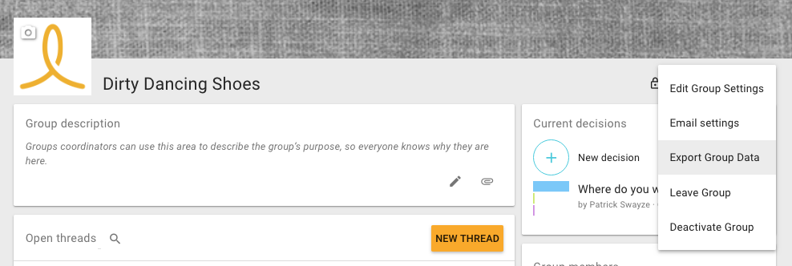

# Export

Exporting your group data is easy!

Open the _Options_ menu on the group page and select _Export Group Data_.

You'll shortly receive an email with a link to downloading the .json file.

# Import

If you are hosting your own Loomio deployment, and would like to import your exported data:

Copy the .json file to the container instance's `import` folder:

`scp your-group-data.json username@some-domain.org:loomio-deploy/import`

Access the running Rails console:

`docker exec -ti loomio-app rails console`

Call the service:

`GroupExportService.import('/import/your-group-data.json')`
