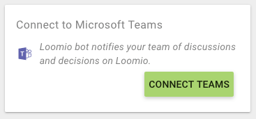
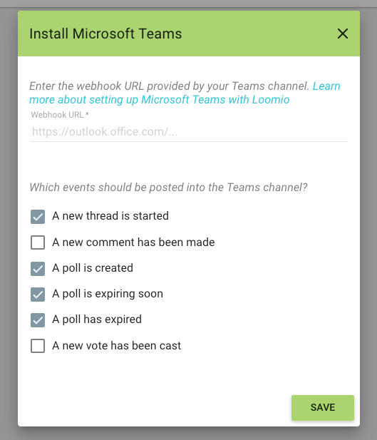

## Slack integration

LoomioBot is publishes activity from your Loomio group into your Slack channel so people can participate directly from Slack.

### Set up Slack integration
From your group page, click "Setup slack" and follow the prompts as shown in this video in order to connect the LoomioBot Slack integration to your Slack channel.

<video width="600" height="400" playsinline muted loop controls>
<source src="setup_slack_integration.mov" type="video/mp4">
</video>

### Remove Slack integration
If you want to change the channel that your Loomio slack integration is connected to, remove the integration as shown in this video:

<video width="600" height="400" playsinline muted loop controls>
<source src="remove_slack_integration.mov" type="video/mp4">
</video>

...and then follow the prompts above in the Set up Slack integration.

## Microsoft Teams

Find the "Microsoft teams" card in your group sidebar.

From Microsoft teams you need to add a new connector. See [this page](https://kb.itglue.com/hc/en-us/articles/115001798191-Setting-up-Microsoft-Teams-webhook-notifications) for help with that.

Hopefully from your time in the MS teams connector interface, you'll have a Webhook URL that you can put into Loomio.

Enter the webhook URL and select which events you'd like to see mentioned within the microsoft teams interface.

You'll receive a success message in Loomio as well as a message within Teams saying you're connected.
