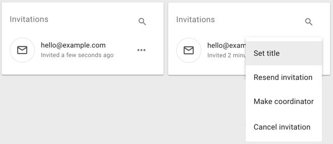
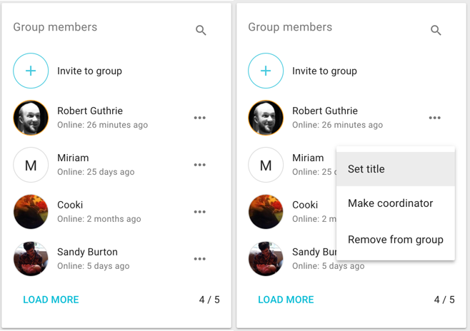

## Inviting people in

There are two ways to invite people into a group:

Enter email addresses into Loomio to send each person their own invitation to join the group.

<video width="600" height="400" playsinline muted loop controls>
<source src="send_invitation.mp4" type="video/mp4">
</video>

Or, copy the Sharable link and share it directly with your team. Use this if you have a group email address or an existing channel where everyone is already connected.

<video width="600" height="400" playsinline muted loop controls>
<source src="share_shareable_link.mp4" type="video/mp4">
</video>

The first method generates a single-use invitation, the second (the sharable link) is something that multiple people can use to join the group.

An invitation is not a user account - meaning that an invitation is not fixed to the email address you sent it to. So if someone already has a Loomio account and you send them an invitation to another email address, they can accept the invitation with their existing account.

You can send multiple invitations by entering multiple email addresses into the who to invite field. When you submit the form an email will be sent to each of the email addresses you supplied, containing a unique invitation link that can only be used once. This email will be sent in your current language.

There is a limit to the number of invitation emails you can send. Any person can only have 100 unaccepted invitations at any time.

For example: At first, you can send 100 invitations. After 50 people accept their invitations, you can send another 50 invitations. This is a necessary limit to prevent bad people from using our platform to send spam email. If you need to send more than this to start your group, send everyone the sharable link.

## Managing invitations

You can also make people coordinators or set their title within the group before they accept their invitation.

### Cancelling invitations
If you entered the wrong email address, or have changed your mind about inviting someone, you can cancel an invitation. Select **Cancel Invitation** from the dropdown menu on the invitations panel.

## Managing memberships

### Coordinators
Also known as "Admin" status. Group coordinators can add and remove members, grant and remove coordinator permissions and modify group settings.

You can grant or remove coordinator permission **Group Members** panel, which is on the Group page.

We recommend that you share the coordinator permission with everyone who is trusted to look after the group.

### Removing group members
On the **Members** page, next to every member there is a **Remove from group** option.

When you click **Remove from group** you'll see a confirmation modal explaining what removal will mean.

### Giving people titles or roles
You can name the role someone has within the group, or identify which organisation they represent using the **title** feature. Just click "Set title" from the memberships panel.

## Membership requests

If your [group privacy settings](/user_manual/groups/settings#privacy) allow people to join your group **By request**, a coordinator will need to approve each membership request. Group coordinators will receive an email each time there is a new membership request. The link in the notification email will take you to the **Membership requests** page, where you can approve or decline the request.

If there is a pending membership request it will also be visible on your group page in a **Membership requests** panel.
