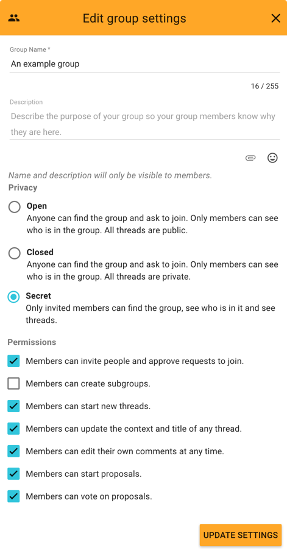

Only group coordinators can edit group settings.

As a coordinator of a Loomio group you’re responsible for guiding your group through the process of learning how to use a new piece of software, as well as learning new processes for collaborating more effectively and making good decisions together. The tasks outlined below can only be performed by group coordinators.

# Adding a cover photo

When you first arrive in your new Loomio group, there will be a randomly selected cover photo, and a placeholder for your group logo. You can customise how your group looks by adding your own cover photo and logo. You can upload a new cover photo or logo by selecting the upload button (camera icon) in either section.

To edit your group settings, open the _Options_ menu on the group page and select _Edit Group Settings_.

# Group name and description

It's best to keep your group name short and concise.

The description should give members a clear understanding of what that group is for or intends to do. Some examples:

"_A public group for us to approve requests for use of the gallery space_"

"_The space for our board members to consider budget proposals_"

# Privacy
Your privacy settings determine who can find your group, who can see the threads in your group, and how people join.

The default privacy setting for new groups is **Closed**. This means people can find your group and ask to join, but the content of your discussions and decisions is private, unless you allow specifc threads to be public (explained in the **Group permissions** section below).

If you want the content of your discussions and decisions to be public, change your group privacy to **Open**. The members list will only be visible to other members.

If you want to hide your group, set your group privacy to **Secret**. This will mean only invited members will be able to see the group name, description, members list, and threads.

NB: If you have a **Secret** group and change it to **Open**, all threads will become public. Changing an **Open** group to **Secret** will make all threads private.

# Advanced settings

Coordinators set the group permissions to configure what members can do in their group.

## Allow public threads

In **Closed** groups, you can use this option to allow public and private threads in your group. When you start a thread, you can decide whether it will be public or private.

## Invite and approve new members

This allows everyone in your group to invite new people in, and approve any membership requests. When it is deselected only group coordinators will be able to invite and approve new members.

## Create sub-groups

This allows everyone in your group to create subgroups. When it is deselected only group coordinators will be able to create subgroups.

## Start threads

This allows everyone in your group to start new threads. When it is deselected only group coordinators will be able to start discussions.

## Edit the context of any thread in the group

This allows everyone in your group to edit the context of any thread. When it is deselected only group coordinators and the thread author will be able to edit the thread context.

## Edit their comments at any time

This allows everyone in your group to [edit their comments](comments.html#editing-a-comment) at any time. When it is deselected, a comment can only be edited until someone else participates in the thread.

## Raise proposals

This allows anyone in your group to start a proposal within a thread. When this box is deselected only group coordinators will be able to raise proposals.

## Vote on proposals

This allows everyone in your group to state their position on proposals. When it is deselected only group coordinators will be able to state their position on proposals.

# Deactivating/archiving a group

Deactivating your group means that you and the rest of the group members will no longer be able to access the group. If you wish to deactivate your group you can do so by selecting **Deactivate Group** from the **Options** menu on the group page. To reactivate your deactivated group, contact the Loomio team by sending an email to [contact@loomio.org](mailto:contact@loomio.org).
