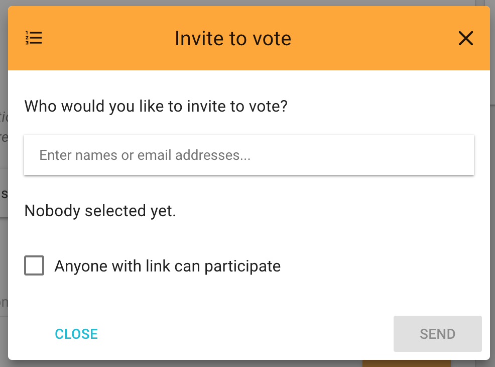

This page is still being written. Please see [Getting Started - Decision tools](/getting_started/decision_tools) for more help.

Questions:

### Can I make a poll where people can vote without logging in?

You can select "Anyone with link can participate" on this screen:

This means anyone can vote without signing in. They just enter their name, email address and vote all at the same time.

### Can I keep a poll open so that any number of people can vote?

Yes, it is. Edit the poll and change the the "closing at" time to be a year (or more) in the future.
