Discussion threads (usually just called _threads_) are where your group can discuss a topic, exchange information and make decisions together.

Threads keep everything about a topic in the same place. Over time you'll create a useful archive of your group's discussions and decisions.

## Starting a thread

You can start a thread by clicking _New thread_ from the sidebar.

<video width="600" height="400" playsinline muted loop controls>
<source src="start_thread_from_sidebar.mp4" type="video/mp4">
</video>

You can also start a thread from your group page.

<video width="600" height="400" playsinline muted loop controls>
<source src="start_thread_from_group_page.mp4" type="video/mp4">
</video>

Select the group you want to have the discussion within. If you started the thread from your group page, this group will be pre-selected.

Give your thread a title. Be concise with your words and try to keep it short.  You can always update the title of the thread later.

Use the context panel to introduce the topic. Give the background information or links that people will need to participate, and explain what kind of participation you're looking for from people.

## Thread privacy
If your group privacy is "Closed" or "Secret" then your threads will be private. Private means that only members of the group, and people you invite into the thread are able to view the thread.

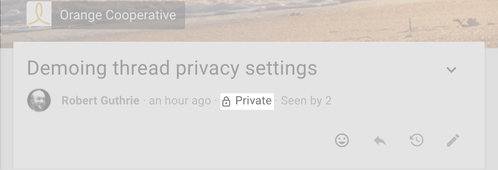

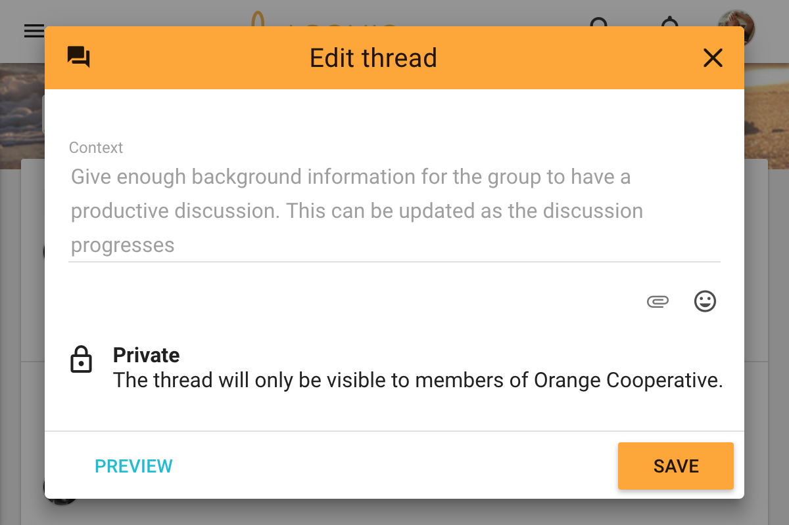

If your group is "Open" then all your threads will be public, meaning that anyone with the url can view the thread.

If your group is "Closed" but you've enabled the [advanced group settting](/user_manual/groups/settings#allow-public-threads) "Allow public threads in this group" then you may choose to make your thread public, but by default threads are private.

## Notifying people
When you're writing your context, you can _mention_ people to ensure they receive a notification about the thread.

<video width="600" height="400" playsinline muted loop controls>
<source src="mentioning_from_thread_context.mp4" type="video/mp4">
</video>

If the thread is an important announcement and contains information that's ready for the whole group to take notice of, you can notify people with the _invite to thread_ screen. People you notify will get an email immediately with the title and context of the thread included.

## Inviting guests and experts to the thread.
If you want to involve people who are not in your group (or even on Loomio yet) you can invite them into the thread by entering their email address. They won't get access to the rest of the threads in your group, just this one. (Invite them to join the group, from the group page, if that's what you intend to do).

<video width="600" height="400" playsinline muted loop controls>
<source src="invite_to_thread.mp4" type="video/mp4">
</video>

## Context panel
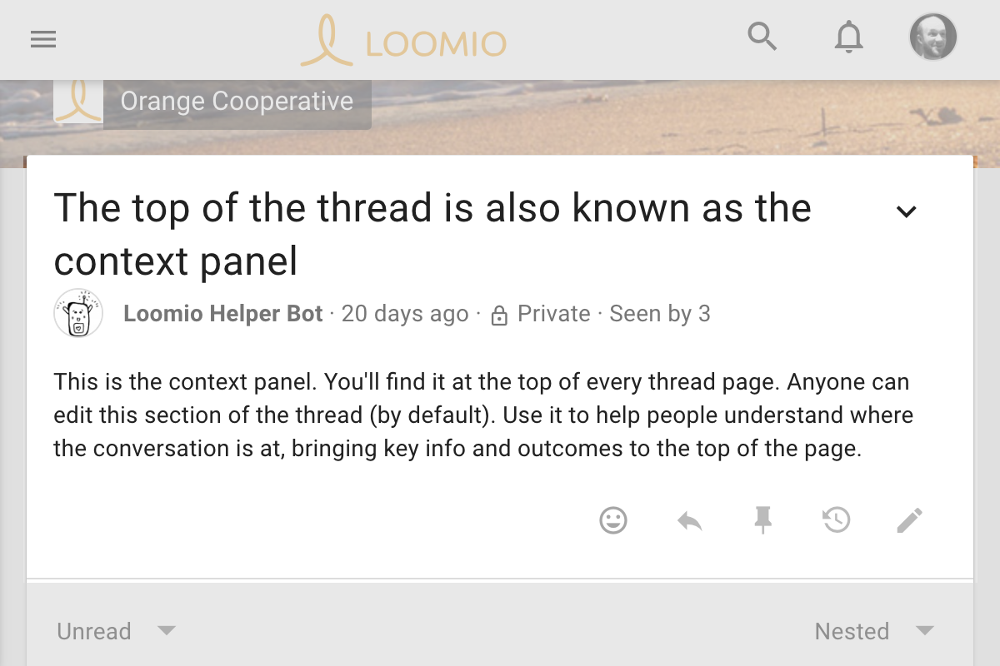
The context panel has special status within a thread. It's always at the top, and it's always visible on the page. Like a comment, you can format your text and attach files or images. Unlike a comment, anyone in the group can update the context (and the title of the thread). This means anyone can jump into the role of helping keep things easy to understand and easy to find.

When you start the thread you should use the context to introduce the topic and kick off the discussion. As the thread grows, update the context with key understandings and information so new people can catch up and participate easily. Think of it as a summary or shared notes area.

## Navigating activity
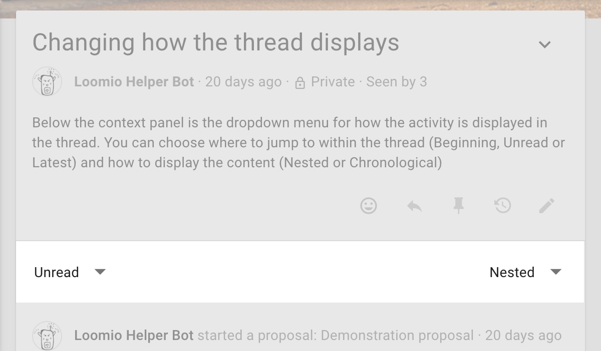

Activity is comprised of all the comments, replies, proposals, polls, votes and other notable things that happen within the thread.

Be default activity is nested, so, a reply comment (or a vote on a proposal) will be displayed just under the comment to which it is replying to.

You can also view the thread chronologically, where all activity is displayed in the other that it happened.

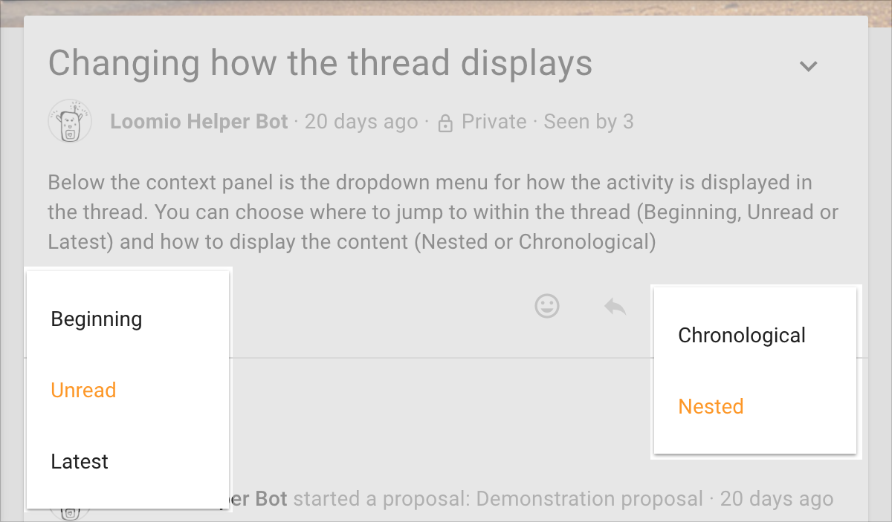

By default you'll be shown activity you have not seen before, and the already seen stuff will be collapsed under a "Load previous" button. If you want to go to the start of the activity you can click "Beginning". To jump to the first new to you activity, click "Unread", and you can jump to the most recent activity by selecting "Latest".

## Unread activity
When activity items are displayed on your screen, Loomio will mark them as having been read. Unread content is displayed with a highlight down the left side and threads with unread content display bold within thread lists.

## Decision tools

There are a selection of "decision tools" available to you within the thread.
- Proposals are there to help you see if there is agreement about a statement or course of action, and surface the disagreement if that's what needs to happen. Often, you can use proposals to bring the discussion to conclusion.
- Polls are useful to understand preferences of the group.
- Use a time poll if you need to get everyone together at once, but don't know when is the best time.

Find out more about [decision tools](../getting_started/decision_tools).

## Comments and replies
The most common activity in a thread is commenting and replying. The comment box is at the bottom of the thread page. Just write your comment in the box and press post to have your say.

When you reply to a comment the author of the original comment will be notified of your reply.

If Loomio has emailed you a comment (and says you can reply to the email), you can reply directly from your email and your message will appear in the thread.

## Mentioning people
If you want to get the attention of a specific person, type **@** into the comment field, followed by their name. As you type, a menu will appear, listing the members in your group that match that name. Select the member you want, finish what you wanted to say to or about them, then **Post** your comment. They will be notified that you’ve mentioned them in a comment.

<video width="600" height="400" playsinline muted loop controls>
<source src="mentioning.mp4" type="video/mp4">
</video>

## Formatting comments
Loomio uses **Markdown** to format text and embed images. For more information on how to use Markdown, read [this guide](https://www.loomio.org/markdown).

## Attaching files
You can attach files to comments using the attachment button next to the **Post** button on the comment form. You will be prompted to select a file from your device.

## Editing comments
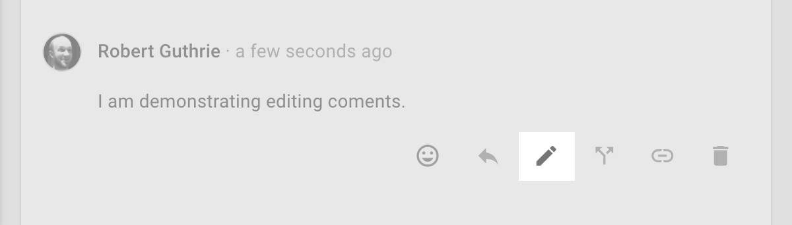

If you've made a typo, or want to add a bit more information to your comment shortly after you've posted it, you can edit your comment. Editing does not grab any attention, IE: No notifications will be sent, and your comment will not be marked as unread again.

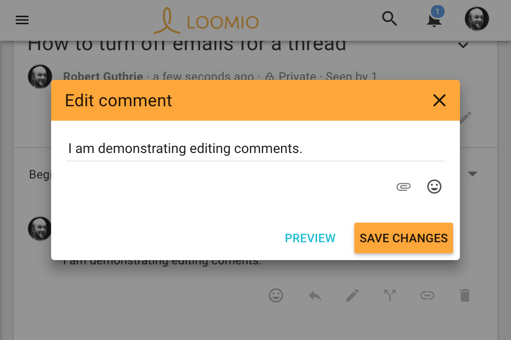

Changes you've made will be visible via the "history" button, so you can see what people have changed in their comment.

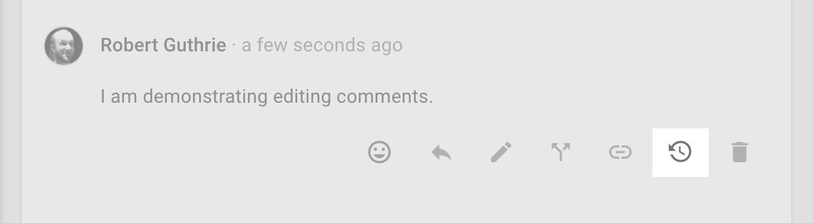

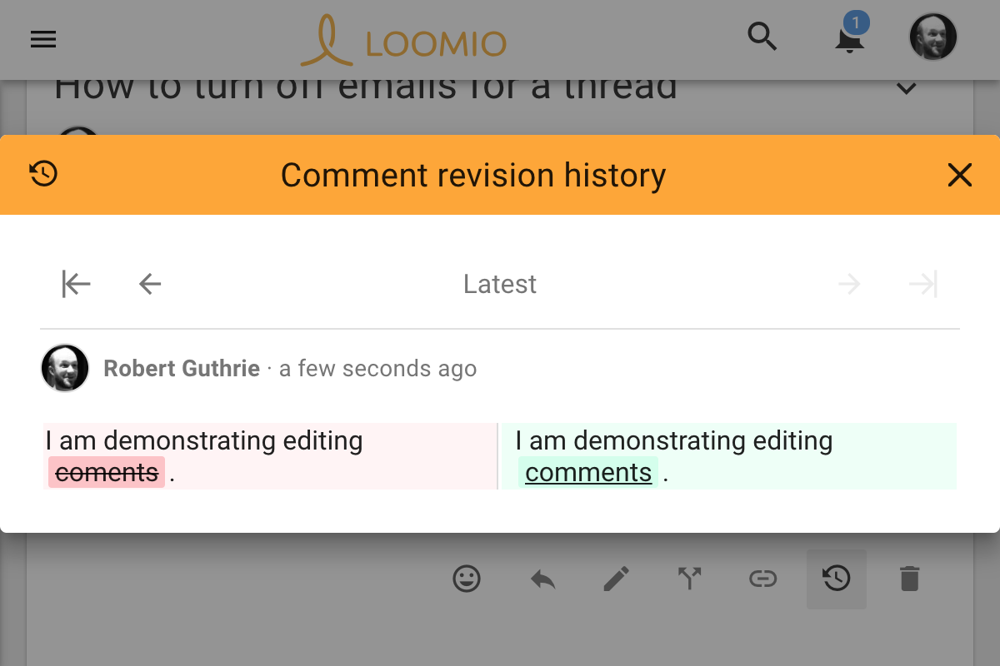

If you have new information or are coming back after an extended period of time, just make a new comment, then people who have already read your comment will see that there is new information.

## Reactions
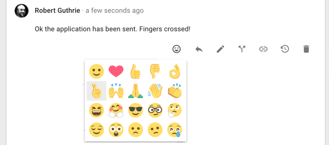
Reactions are for sharing how a comment made you feel, or acknowledging something someone has said, without writing a comment. They're an unobtrusive, light-weight way to participate without interrupting the conversation.

## Translation of comments
<video width="600" height="400" playsinline muted loop controls>
<source src="inline_translation.mp4" type="video/mp4">
</video>

Loomio can translate a comment from one language into another automatically (with the help of Google Translate). If the author of a comment uses a language other than yours, a translate button will show up; Just click see the translation.

## Email notifications
By default you'll be subscribed to receive email notifications about activity in a thread if you participate in it. If you don't want to be emailed further activity in a thread when you participate, [edit your preferences](https://www.loomio.org/email_preferences) and turn off "
Subscribe on participate".

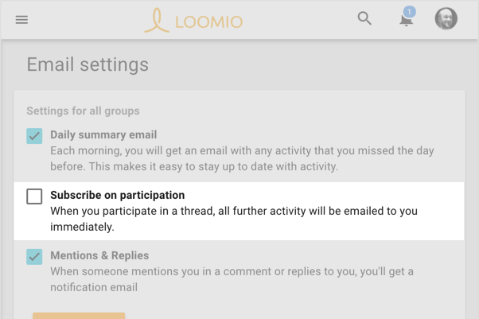

If you're already subscribed to a thread, you'll need to turn off emails for it, because "subscribe on participation" only takes effect for threads you participate in after changing the setting.

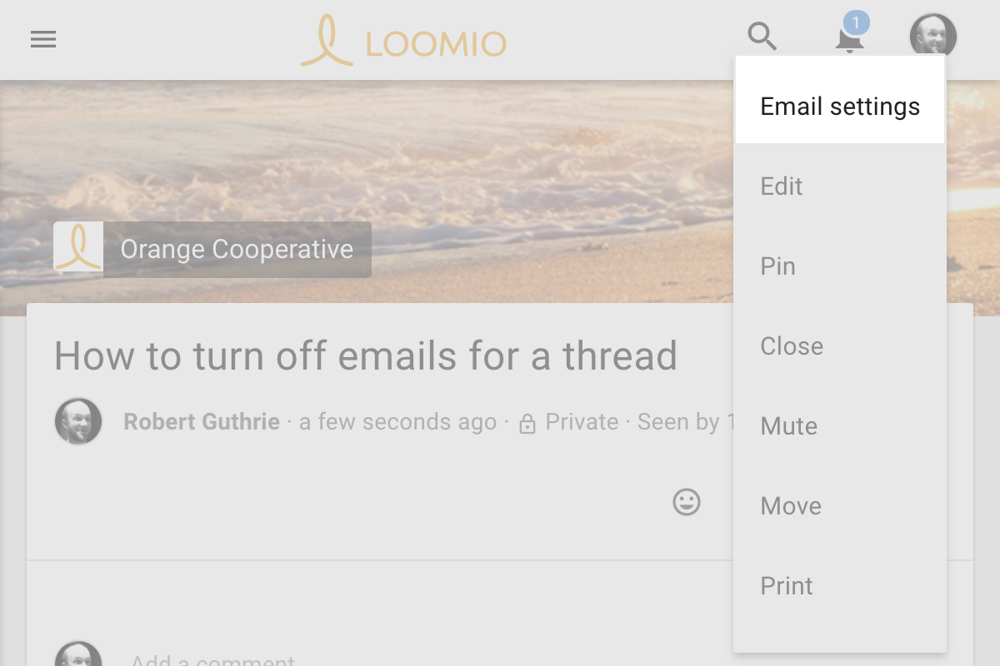

The default setting is "Announcements", which means you'll get an email notification when someone wants to notify you about a decision, but you won't get an email about comments unless you're mentioned or replied to.

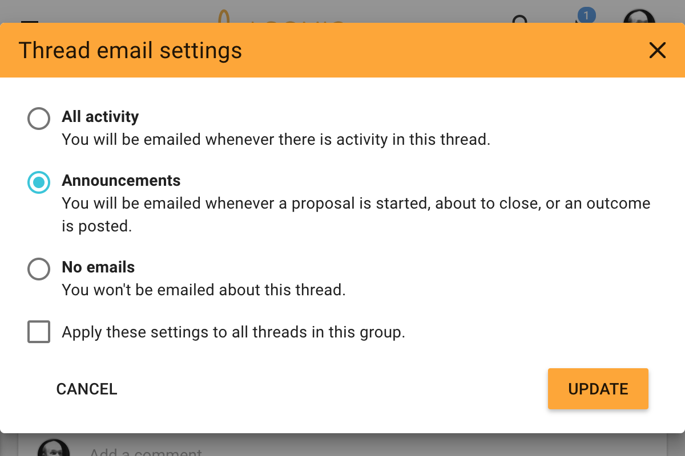

## Thread members and roles
Everyone who's participated in the thread, or has been invited specicially to participate will show up in the members panel.

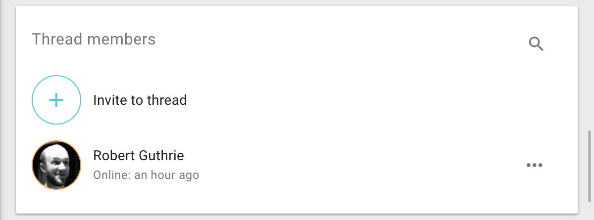

To highlight your role within the discussion, or to let people know why you're here, you can update your _title_ from the members card. The title will display next to you name where ever it appears within the thread.

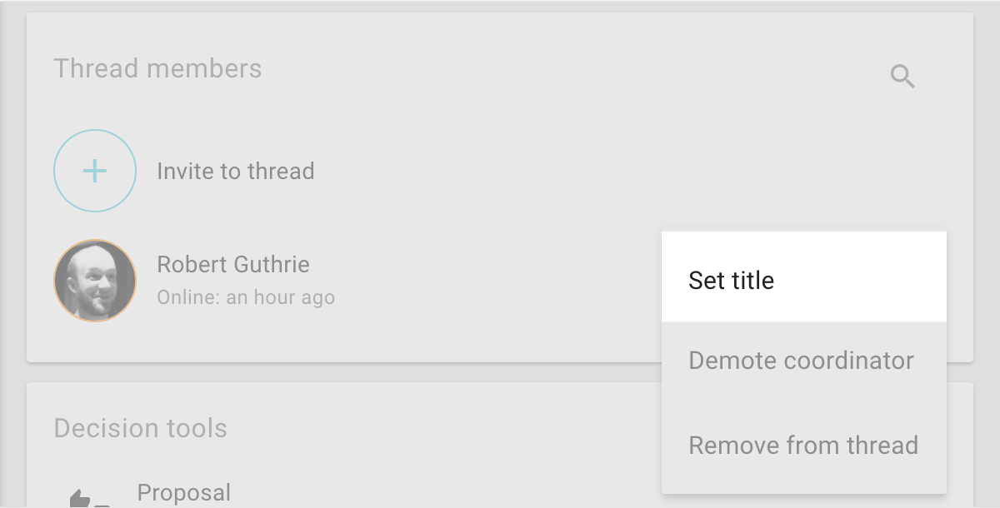
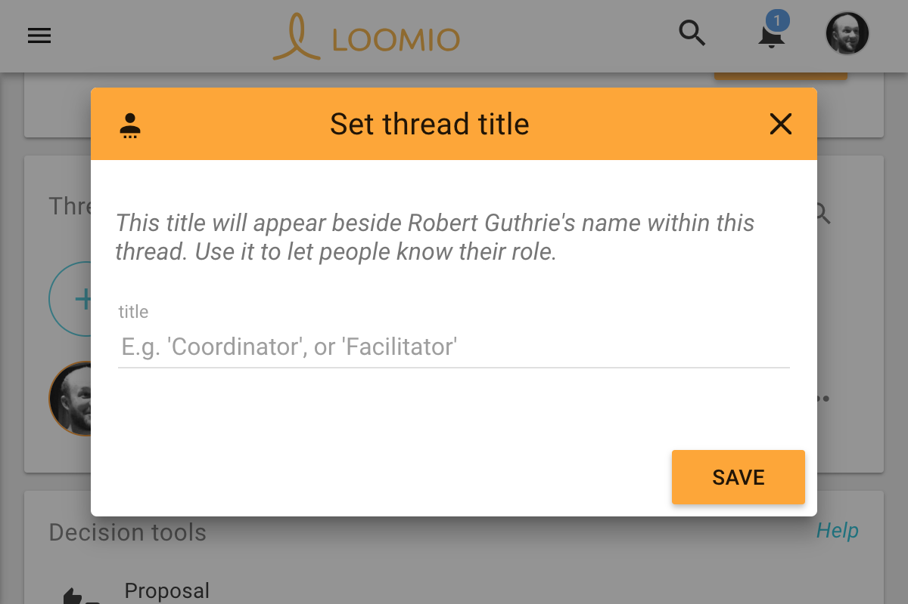

## Deleting comments
You can delete your own comments at any time. If you're the coordinator of a group you can delete any comments in any of the threads in the group. If you started a thread, you can delete that thread, or any comments within it.

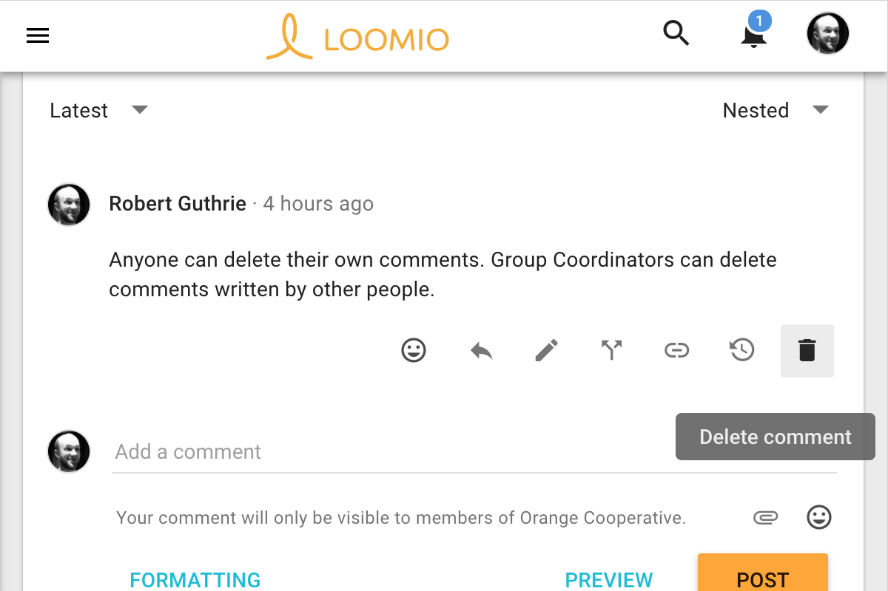
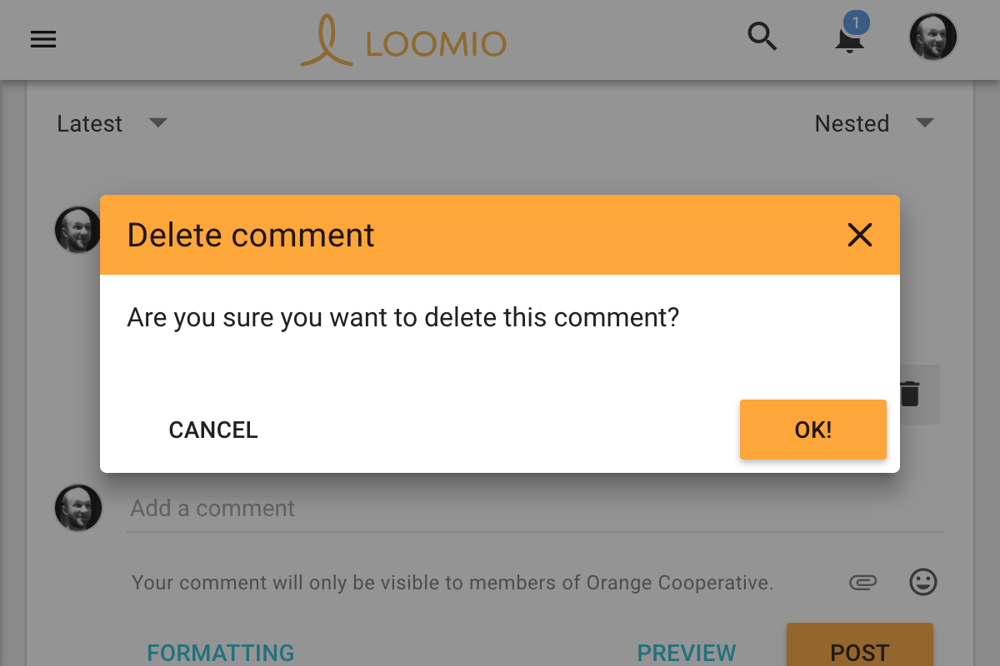

## Moving comments to a new thread (Forking)
<video width="600" height="400" playsinline muted loop controls>
<source src="forking_comments.mp4" type="video/mp4">
</video>

Sometimes a comment is useful, but off topic for the thread. In this case you can start a new discussion, selecting the comments to take into it from the current thread.

## Moving threads between groups
You may want to move threads between groups and subgroups to keep things organised. You can do this with the move thread option in the dropdown menu at the top of the thread.

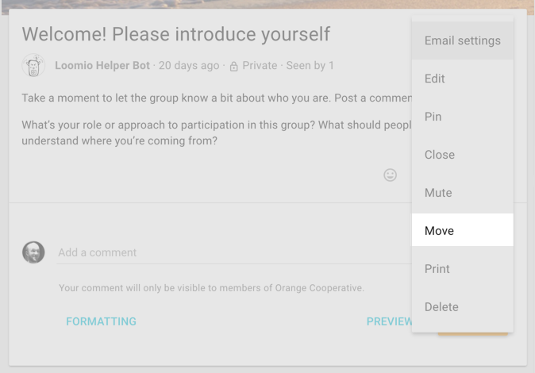
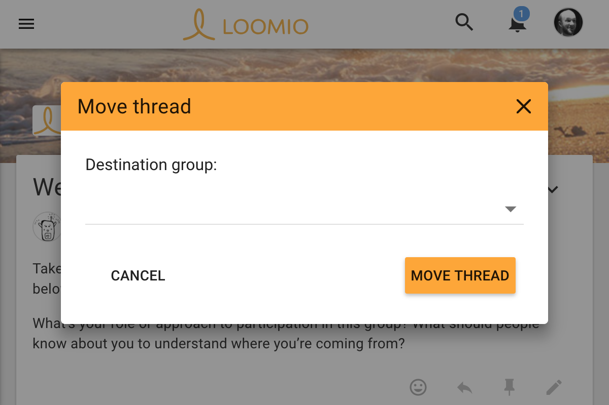

## Closing threads
To keep the list of discussions on your group page relevant, you can close threads which people don't need to see.

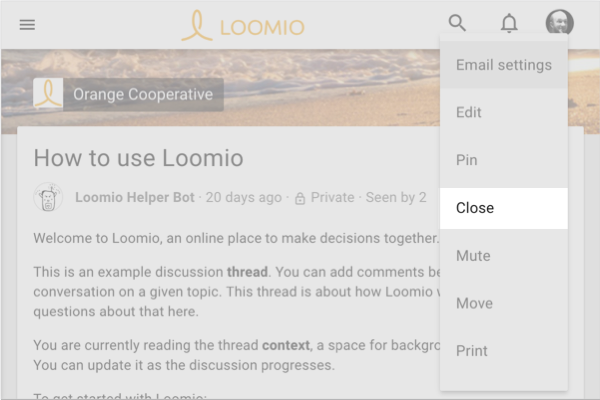

You can list all the closed threads. Just click the "x Closed" label at the top of the threads list on your group page.

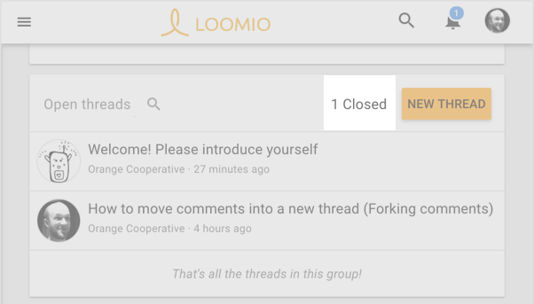

## FAQ

### How can I send a message to everyone in my group?
If you have an important message, and you want to ensure that everyone in your group to receive it, start a discussion and invite everyone into it.

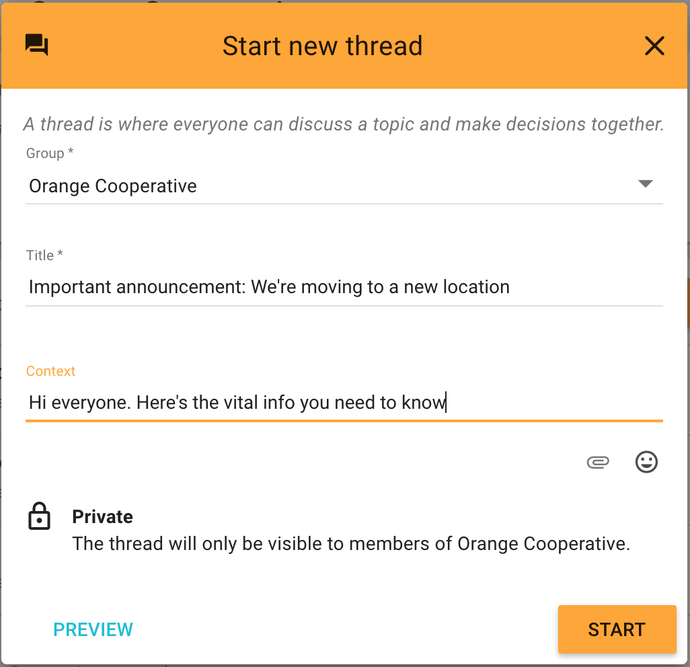
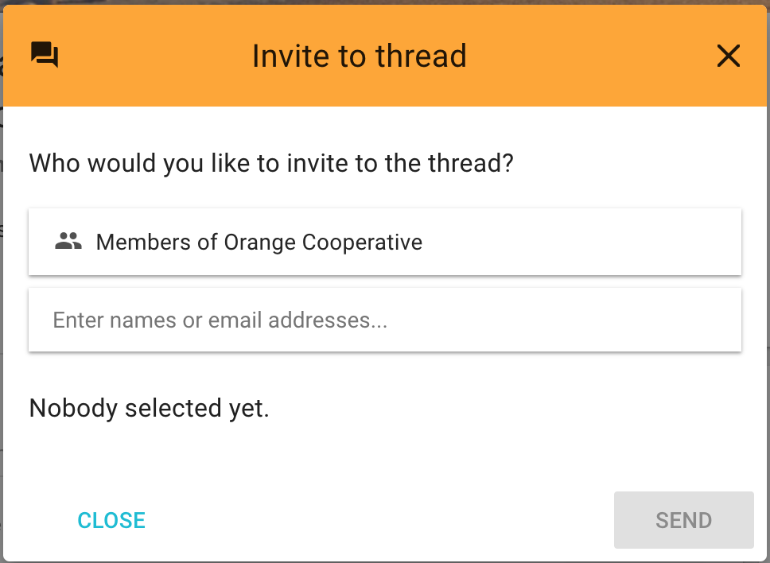
