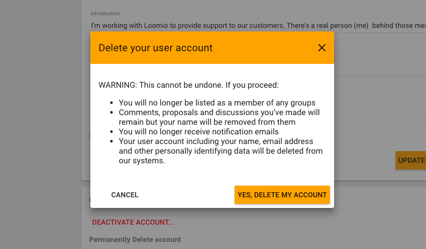

## To delete your account entirely:

 1. Login to Loomio, and click on your account avatar or initials, at the top right of your screen.
 2. Scroll to the bottom, and click on DELETE ACCOUNT.
 3. A pop up will appear - click on YES, DELETE MY ACCOUNT.

## I've deleted my account - what does this mean?

Loomio takes privacy and data protection very seriously. Here is a link to our [policy](https://www.loomio.org/privacy) - if you have any questions about our policy, you can [get in touch](https://www.loomio.org/contact) with us.

When your account is deleted, we remove all of your personal information, permanently. Comments, proposals and discussions you’ve made will remain but your name will be removed from them. We do this because we have an obligation to groups to keep threads and proposals coherent.

It is important that you understand that copies of the data you have generated on Loomio have likely been emailed to everyone in the group - Loomio has no ability to delete those.
