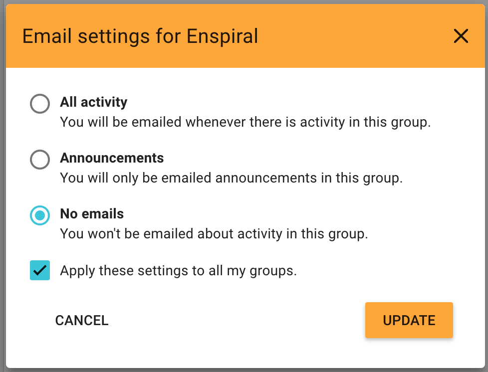

Loomio sends emails to keep you updated on the activity in your groups. The default settings assume that you don't have a habit of using Loomio regularly so are designed to ensure you can stay up to date by checking your emails.

Emails we send out include:

- A daily summary called _Yesterday on Loomio_. This includes activity from all your groups and threads - but only content which you have not read yet.

- _Mention_ and _Reply_ notifications - If someone replies to a comment you wrote, or they write a comment and mention you in it, you'll get an email with what they wrote.

- New Thread and poll notifications. If someone wants to notify the group about a new decision or discussion thread, they can select everyone or just some people in the group to notify. Also be aware of _poll closing soon_ and _outcome_ notifications.

- Thread updates. If "subscribe on participation" is checked, then after you comment or vote within a thread, you'll be emailed any further activity.

For any _thread_ specific email (that's most things except the "Missed Yesterday" email) you can reply directly from your email and your replies will be posted in the Loomio thread.

## User email settings

There are three settings that apply to every group you belong to.

* **Daily summary email**: Enabling this setting means each morning you will get an email with any activity that you missed the day before. This email provides an easy routine for staying up to date with Loomio activity.
* **Subscribe on participation**: Enabling this setting means when you participate in a thread, all further activity will be emailed to you immediately.
* **Mentions**: Enabling this setting means when someone wants to get your attention, they can @mention your name in a comment, which will notify you. We recommend you leave this setting on, so you'll get an email when this happens.

## Group email settings

You can configure what notification emails you get for each group you belong to.

There are 3 settings per group:

- _All activity_ - If you want the experience of a traditional email mailing list, where you are emailed everything as it happens. You will be emailed whenever there is activity (comments, votes, new threads, proposals, and proposal outcomes) in this group.

- _Important activity_ - When someone invites you to vote or participate in a thread you'll get an email. In these cases someone in your group is choosing to notify you.

- _No activity_ - You won't get notification emails about this group. It's up to you to check into Loomio or read your daily summary email to stay updated.

You can also apply a particular setting to all of your groups by checking *Apply these settings to all my groups*.

## Changing the default for new groups
You can ensure that any new groups you join have the settings you prefer.

<video width="600" height="400" playsinline muted loop controls>
<source src="set_default_group_email_settings.mp4" type="video/mp4">
</video>

## Thread email settings

The email settings for a thread are similar to those for a group. A thread will use the email settings for a group unless you change it for that thread.

Note that the _subscribe on participation_ setting affects your thread email settings. If _subscribe on participation_ is enabled, when you participate in a thread your email settings will change to "All activity" for that thread.

## Turn off all notifications

To turn off all email notifications visit https://www.loomio.org/email_preferences/

First you need to turn off all user emails:

Then to turn off all emails for all groups, click EDIT next to your first group.

See the "Apply these settings to all groups" this will turn off emails for all your groups.
