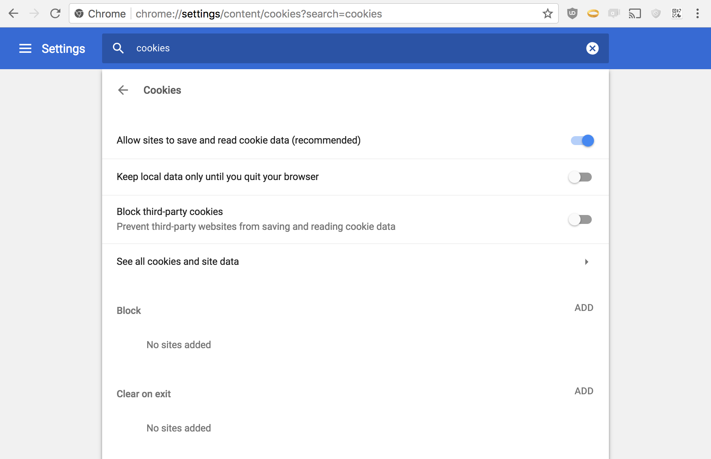
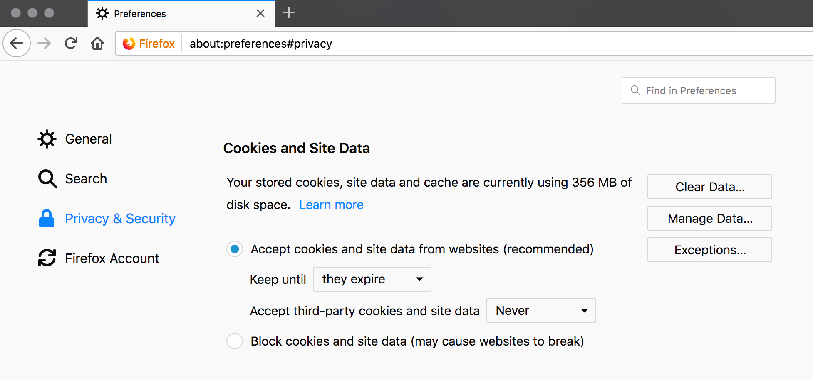
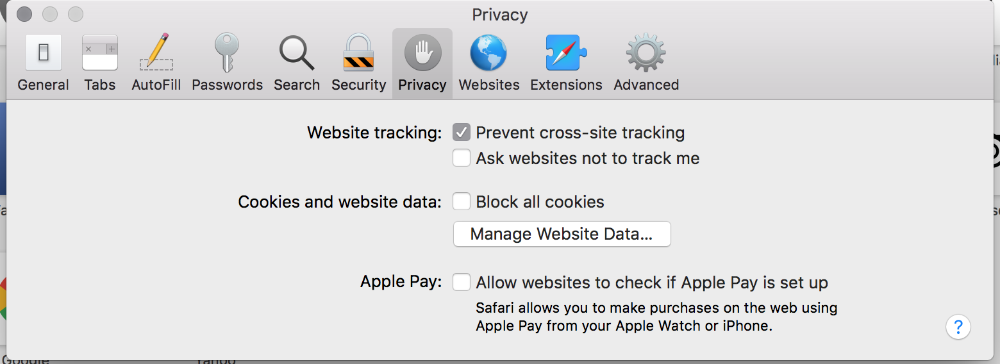

Creating a new user account and signing into an existing account both start from the sign in form:

## User accounts are identified by email address
Loomio user accounts are identified by an email address. If you sign in via a third party such as Google, we'll use the email address of your Google account.

This means you can login via email (or password) even if you login via a third party to begin with.

## Creating a new user account
It's recommended to sign in via Google or Facebook (if you use those services) because for most people it's faster, more secure, and less complex than using a password. Another benefit is that you won't need to manually upload a profile photo. Loomio does not read other information from your sign in provider (see our [privacy policy]({{ site.loomio_app_url }}/privacy)).

If using a third party sign in isn't right for you, signing in via email is well supported too. Use the email address that you want to receive Loomio notifications with.

## Signing in via email
When you sign in via email, you'll be sent an email with a link (or a code) to sign in.

## Tips for a better experience

### Set a password
If you tire of checking your email to sign in, you can easily set a password. To do this, first sign in via the email link, then on the sign in confirmation screen you'll see a prompt to set a password.

### Use the code if you check your email on another device
You may want sign into Loomio on your laptop but you check your email with your phone (or vice versa). In these cases, using the sign in link will leave you signed into Loomio on the wrong device. This is why we include a code to login. Just enter the code from your phone into the login screen on your laptop.

### You can sign in via email even if you first signed in via Google
After creating an account via a third party (eg: Google), you can still sign in via email. Just enter the email address associated with your Google account into the sign in via email field.

### Linking a third party to an existing user account
If you want to sign in with a third party (eg: Google) but you already have a Loomio account with another email address, you can _link your accounts_. To do this, just sign in via your preferred third party, Loomio will recognise it's your first time using that sign in method and will ask if you want to create a new account or link this sign in method to your existing user account.

### Don't create more than one user account
Remember to use the same email address each time you login, or you may end up with two user accounts, which will cause permission errors when you're checking notifications.

Sometimes people think they need two Loomio accounts because they have two groups and they want to keep things separated; However, Loomio is designed to support belonging to multiple groups with one user account.

### You can accept an invitation sent to another email address
Invitations are not tied to the email they are sent to. If someone sends you an invitation to an email address other than the one you use for your Loomio user account, you do not need to create a new user account or get the invitation re-sent.

Just click the invitation link and login to your existing Loomio account as you proceed.

### Merging user accounts
If you do find yourself with more than one user account, we can merge your accounts. [Contact us]({{ site.loomio_app_url }}/contact) and include both email addresses that you have accounts under, and specify which one you want to hold on to.

## Troubleshooting

### I can't see any of my groups!
To fix this: Sign out then sign in again with the email address you normally use loomio with.

Why does this happen? This can happen because you participated in a poll when you were not signed in; Loomio creates a guest user, so you can participate without signing in. When you sign in later, we confirm the authenticity of your vote and connect it to your registered user.

### Every time I visit Loomio I have to sign in!

Ensure your browser is not deleting cookies. If you find that you're logged out of Loomio every time you visit, your browser may be configured to delete cookies when you close the browser window. Cookies are the way we recognise you when you use Loomio, so deleting them means you need to identify yourself (ie: sign in) every time you visit.

Here are screenshots of what correct cookie settings look like:

Chrome cookie settings

Firefox cookie settings

Safari cookie settings

