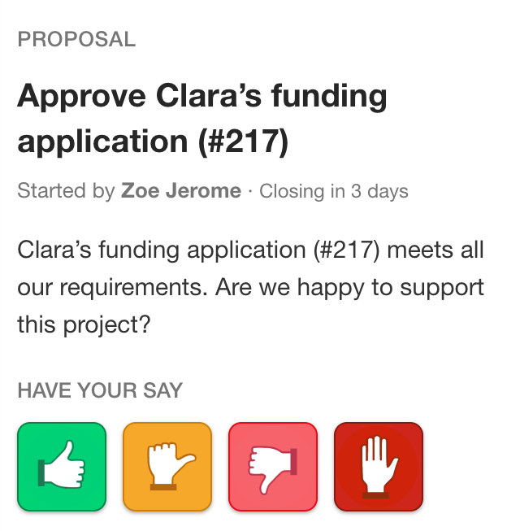
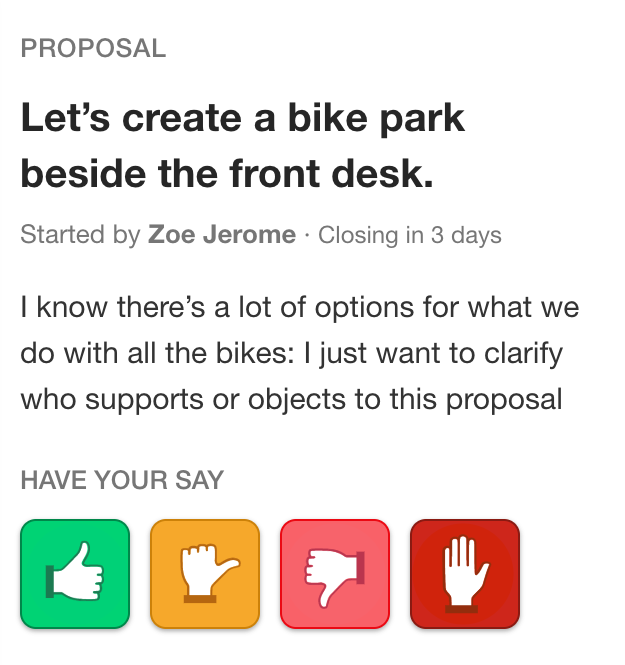
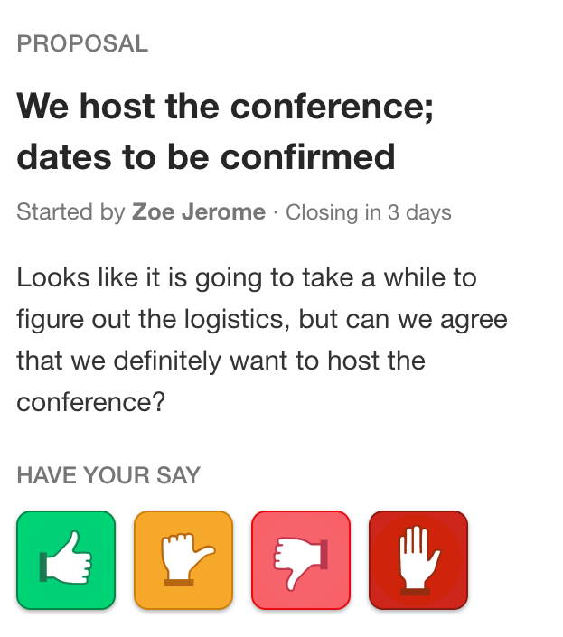
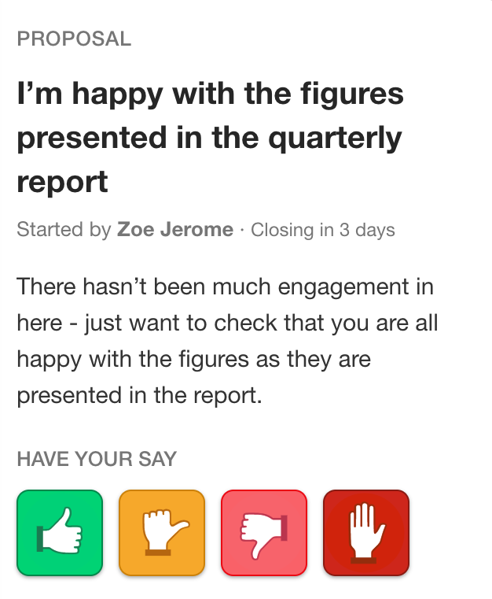
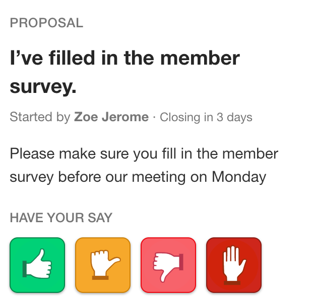
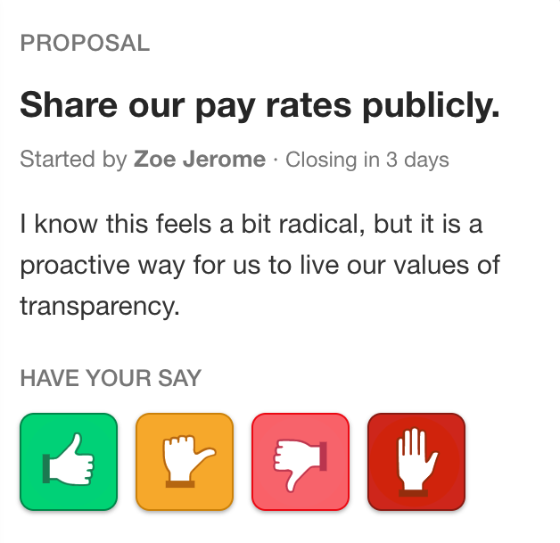
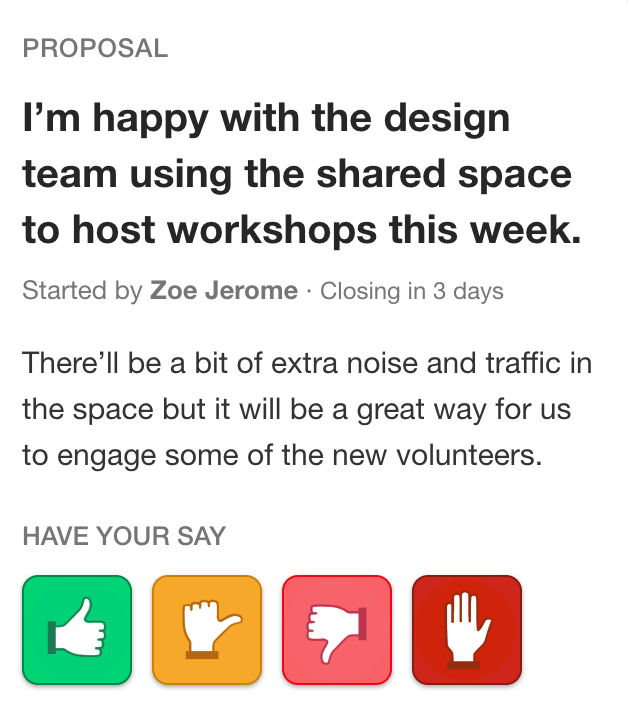
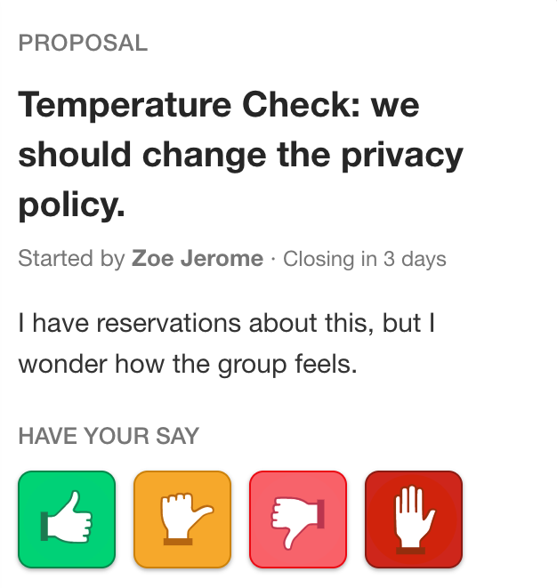
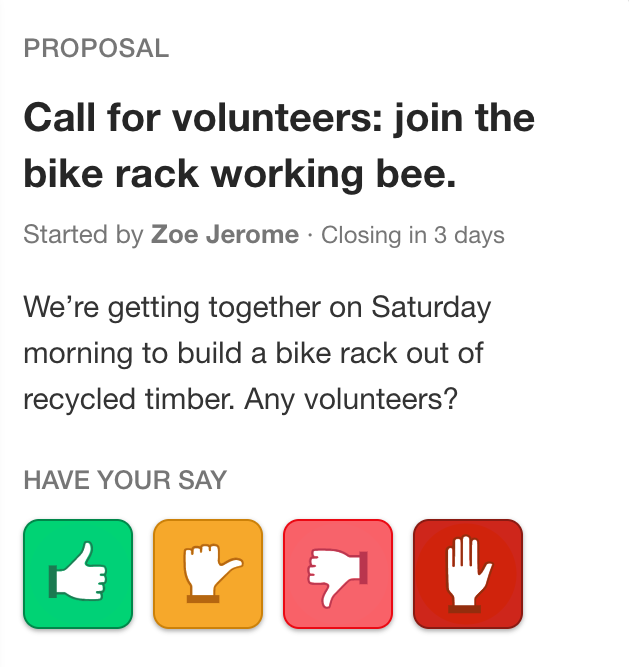

# Using proposals
[Proposals](https://help.loomio.org/en/proposals.html) are a flexible and powerful tool for *convergence* — bringing a discussion to a conclusion or clear outcome. Groups that use proposals tend to get more value out of using Loomio.

Proposals are *not* only for when you have consensus. They are very useful for clarifying any disagreements, inviting more participation, and helping issues progress.

## Start your first proposal now
Our research shows that groups that have 2 proposals in their first week continue to use Loomio successfully for a long time.

Chose a real topic relevant to your group, big or small, that participants will have a view on. Use proposals early and often to help users understand their value, so when a critical issue arises, you'll be ready.

<iframe width="560" height="315" src="https://www.youtube.com/embed/LlfggpCaW4s" frameborder="0" allowfullscreen></iframe>

## Keep them coming
If someone writes a comment that suggests a course of action or decision, encourage them to raise it as a proposal.

> @vijay that's a great idea! Why don't you raise it as a proposal to see what everyone else thinks?

Don't hesitate if you're not sure everyone will agree! The most valuable proposals have a mix of views and cause the group to work together to find the best solution. Or you might be surprised by getting quick consensus on something you thought was going to be complicated.

## Be specific

Include concrete details so everyone knows what it means to agree or disagree.

Avoid combining a range of ideas in one proposal, because people might agree to some aspects but not others and be unsure how to respond. You can break complex decisions down into multiple sequential proposals.

## Think about closing time
Consider how the proposal closing time will affect engagement from your group members, and chose accordingly. You might want to time the proposal so it closes before a meeting, or avoid closing on a weekend.

Some decisions need to be made very quickly. Others should allow time for deeper discussion, and for people to change their minds as they listen to one another.

If needed, you can extend the deadline of an open proposal. This can be a good idea if engagement is active and people are working through the issue, or if engagement has been sparse and you'd like to prompt more participation before concluding.

<iframe width="560" height="315" src="https://www.youtube.com/embed/Id8NYW_jTJ8" frameborder="0" allowfullscreen></iframe>

## What's the outcome?
When your proposal closes, you’ll be prompted to set a proposal outcome.

Loomio is not a poll, where the position with the most votes wins. What the outcome of a proposal means for your group is up to you to define. Sometimes it makes sense to go with the majority, but sometimes even one dissenting voice means it's a no.

Group members will be notified of the outcome, so it's a very useful tool for keeping people in the loop, clearly defining next steps and naming specific people's action points, or summarising what was learned from the proposal (whether or not it was conclusive).

Examples:

> This proposal did not reach consensus because several people were concerned about budget impacts. George and Jimena will do some financial modelling and raise a new proposal next week.

or

> I've taken on board everyone's input. As the project manager, this is my call to make and I've decided we are going to extend the timeline by 10 days.

Setting outcomes makes your historical decision archive easy to search, because you have a succinct statement for each proposal.

<iframe width="560" height="315" src="https://www.youtube.com/embed/5KzVvKmtrCc" frameborder="0" allowfullscreen></iframe>

## Ways of using proposals
Proposals are flexible, and can be used in a range of ways.

  
  <h3>Consensus Finder</h3>

  If the comments seem to point to general agreement, test this assumption by proposing agreement explicitly. You’ll either get a mandate to act, or you’ll uncover important concerns.

  

  <h3>Uncover the Controversy</h3>

  If there are two or more clear competing ideas, propose supporting one. Controversial topics might require a series of proposals to build shared understanding.

  
  <h3>Series of Small Yes’s</h3>

  Break down a complex issue into smaller parts and agree them piece by piece. Start with the high level decision — for example, it's not productive to spend time working out the details of an event before agreeing that you want to host it at all.

  
  <h3>Silent Majority</h3>

  If you need sign-off to move something forward, raise a proposal to prompt engagement within a specific timeframe. Discussions are open ended, but proposals have deadline.

  
  <h3>Engagement Request</h3>

  If you need everyone in your group to complete an action, such as reading a document before an important meeting, use and Engagement Request proposal to define a deadline. Loomio will automatically send out reminders, and you can visually see who has responded. Make sure you make it easy for people to fulfil your request by including any relevant links or documents.

  
  <h3>Polarising Minority</h3>

  Sometimes loud voices can seem like they are representing more of the group than they really are. Raise a proposal to reveal that dissenting parties are in the minority, and put their views in perspective.

  Give them a chance to clearly state their objections, and challenge them to articulate the crux of the issue. They may realise their position is not supported by others and reconsider, or perhaps their concerns will change everyone's minds.

  
  <h3>Window of Opportunity</h3>

  Have you heard the phrase, “speak now or forever hold your peace”? The Window of Opportunity proposal is a way to discover important information or reservations, and to get a mandate to move forward quickly otherwise.

  
  <h3>Temperature Check</h3>

  A temperature check is a way to test how the group feels without concluding a fully realised proposal. Use it when you want to survey opinions, or test a hunch, rather than advocate for a particular position.

  
  <h3>Any Volunteers?</h3>

  Raise a proposal which asks for people to say “yes” if they are committing. This will give you a list of people to follow up with to form a working group or send invitations to. A great way to turn conversation into action.

---

Further details about about [how proposals work](https://help.loomio.org/en/proposals.html) can be found in the Loomio help manual.
